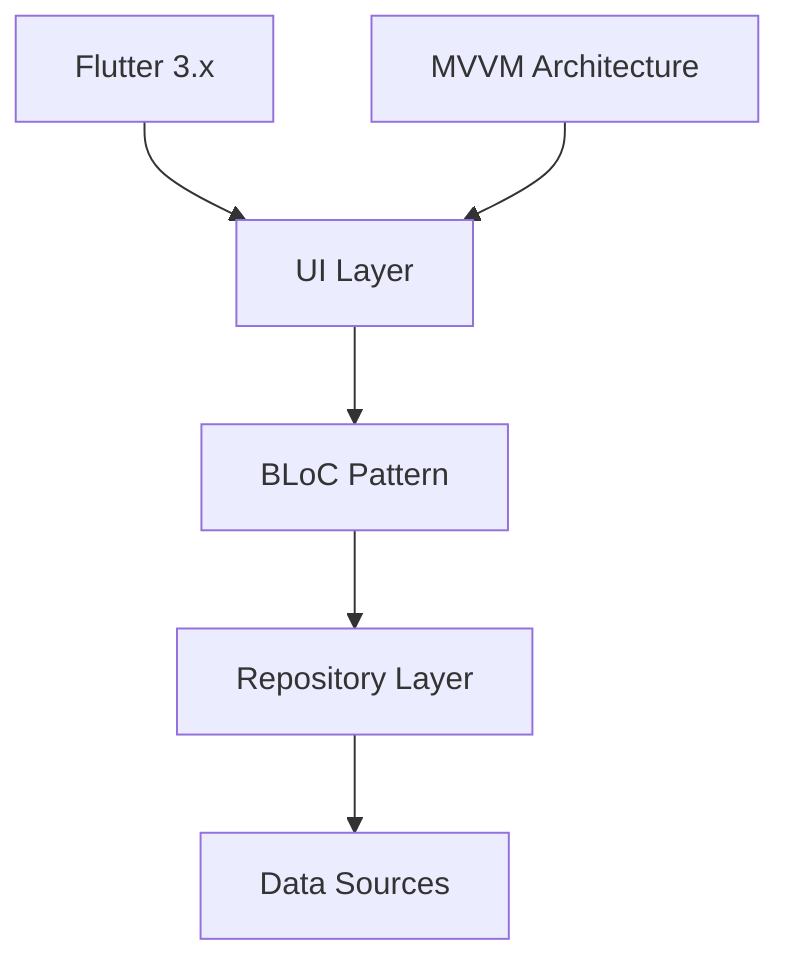

# 🌟 PulseHub Platform

<div align="center">
  

  <h2>Industrial IoT Monitoring Solution</h2>

  <p>
    A powerful Flutter-based industrial IoT monitoring platform with real-time sensor data visualization, analytics, and collaboration features.
    <br/>
    Built with modern Flutter architecture, following clean code principles and industry best practices.
  </p>

  <p>
    <a href="https://github.com/ahmedtohamy1/PulseHub/issues/new?template=bug_report.md">Report Bug</a>
    ·
    <a href="https://github.com/ahmedtohamy1/PulseHub/issues/new?template=feature_request.md">Request Feature</a>
  </p>

  <div>
    
    
    
    
  </div>
</div>

## 📱 Features Overview

### 🏭 Industrial IoT Monitoring

- **Real-time Monitoring**

  - Live sensor data visualization with dynamic charts
  - Customizable refresh rates and data points
  - Sensor health status indicators
  - Real-time alerts and notifications

- **Data Analysis**

  - Historical data trends with interactive graphs
  - Custom date range analysis
  - Data export in multiple formats
  - Comparative analysis tools

- **Sensor Management**
  - Comprehensive sensor inventory
  - Sensor type categorization
  - Automated sensor discovery
  - Sensor calibration tracking

### 🎨 Project Management

- **Project Dashboard**

  - Modern card-based UI for project overview
  - Project timeline visualization
  - Financial tracking and budgeting
  - Document management system

- **Customization Options**
  - Theme customization with Material 3
  - Custom dashboard layouts
  - Configurable data displays
  - Personalized alert thresholds

### 👥 Team Collaboration

- **User Management**

  - Role-based access control
  - Team member permissions
  - Activity logging and audit trails
  - User profile management

- **Group Management**
  - Project-based groups
  - Hierarchical team structure
  - Group permission inheritance
  - Collaborative workspaces

### 🔐 Security Features

- **Authentication**

  - Multi-factor authentication
  - Biometric login support
  - Session management
  - Password policies

- **Data Protection**
  - End-to-end encryption
  - Secure API communication
  - Data backup and recovery
  - Compliance with industry standards

### 📊 Analytics & Reporting

- **Data Visualization**

  - Interactive charts and graphs
  - Custom report generation
  - Data export capabilities
  - Real-time analytics dashboard

- **Performance Metrics**
  - System health monitoring
  - Resource utilization tracking
  - Performance optimization tools
  - Automated reporting

## 🏗️ Architecture

### Core Technologies



### Key Components

- **UI Layer**: Material 3 Design, Responsive Layouts
- **State Management**: BLoC Pattern with Cubit
- **Navigation**: GoRouter for declarative routing
- **Dependency Injection**: GetIt with Injectable
- **API Communication**: Dio with Interceptors
- **Local Storage**: Secure Storage, SQLite

### Project Structure

```
lib/
├── 🔧 core/
│   ├── di/          # Dependency Injection
│   ├── env/         # Environment Config
│   ├── helpers/     # Utility Functions
│   ├── layout/      # Base Layouts
│   ├── networking/  # API Layer
│   ├── routing/     # Navigation
│   ├── theming/     # App Theme
│   └── utils/       # Common Utils
│
├── 📱 features/
│   ├── auth/        # Authentication
│   ├── dashboard/   # Main Dashboard
│   ├── manage/      # Management
│   └── project/     # Project Features
│
└── 🚀 main.dart     # Entry Point
```

## 🚀 Getting Started

### Prerequisites

- Flutter SDK (3.x or higher)
- Dart SDK (3.x or higher)
- Android Studio / VS Code
- Git

### Installation Steps

1. **Clone the Repository**

```bash
git clone https://github.com/ahmedtohamy1/PulseHub.git
cd PulseHub
```

2. **Install Dependencies**

```bash
flutter pub get
```

3. **Configure Environment**

```bash
cp .env.example .env
# Update environment variables in .env
```

4. **Generate Code**

```bash
flutter pub run build_runner build --delete-conflicting-outputs
```

5. **Run the App**

```bash
flutter run
```

### Environment Setup

```env
# Development Environment
DEV_BASE_URL=https://dev-api.example.com
DEV_API_KEY=your_dev_api_key

# Production Environment
PROD_BASE_URL=https://api.example.com
PROD_API_KEY=your_prod_api_key
```

## 🤝 Contributing

We welcome contributions! Here's how you can help:

1. **Fork the Repository**
2. **Create a Feature Branch**

```bash
git checkout -b feature/AmazingFeature
```

3. **Commit Changes**

```bash
git commit -m '✨ Add some AmazingFeature'
```

4. **Push to Branch**

```bash
git push origin feature/AmazingFeature
```

5. **Open a Pull Request**

### Coding Guidelines

- Follow Flutter/Dart best practices
- Use meaningful variable and function names
- Write comprehensive documentation
- Include tests for new features
- Follow the commit message convention

## 👨‍💻 Creator

<div align="center">
  
  <h3>Ahmed Tohamy</h3>
  <p>
    <a href="https://github.com/ahmedtohamy1">
      
    </a>
    <a href="https://www.linkedin.com/in/ahmedtohamy1">
      
    </a>
  </p>
</div>

### Support the Project

<div align="center">
  <a href='https://paypal.me/ahmedtohamy1'>
    
  </a>
</div>

## 📄 License

Copyright © 2024 Ahmed Tohamy. All rights reserved.

## 🙏 Acknowledgments

- Flutter Team for the amazing framework
- All contributors who have helped shape this project
- The open-source community for their invaluable tools and packages

---

<div align="center">
  Made with ❤️ by <a href="https://github.com/ahmedtohamy1">Ahmed Tohamy</a>
</div>
